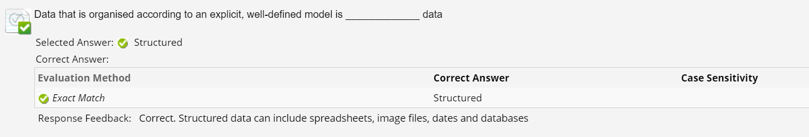
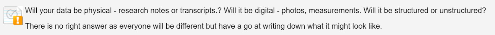
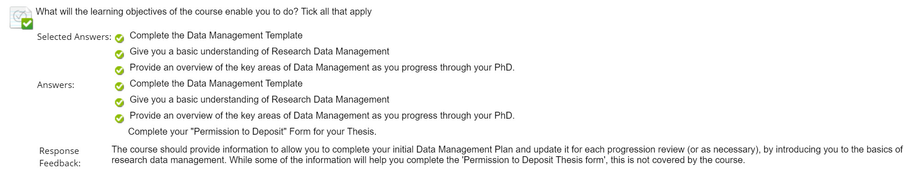
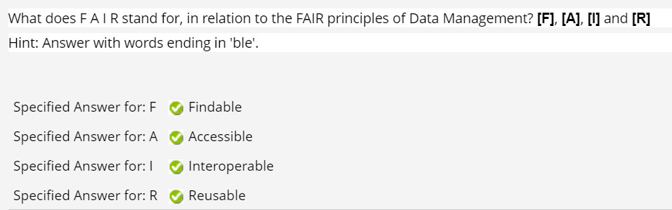
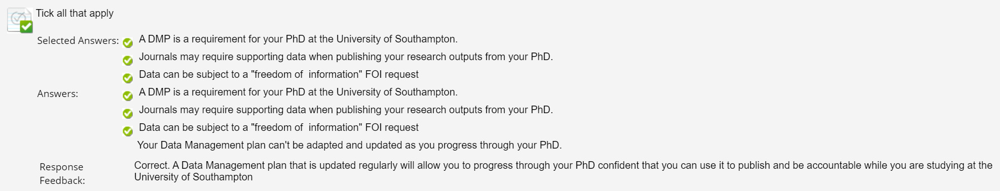
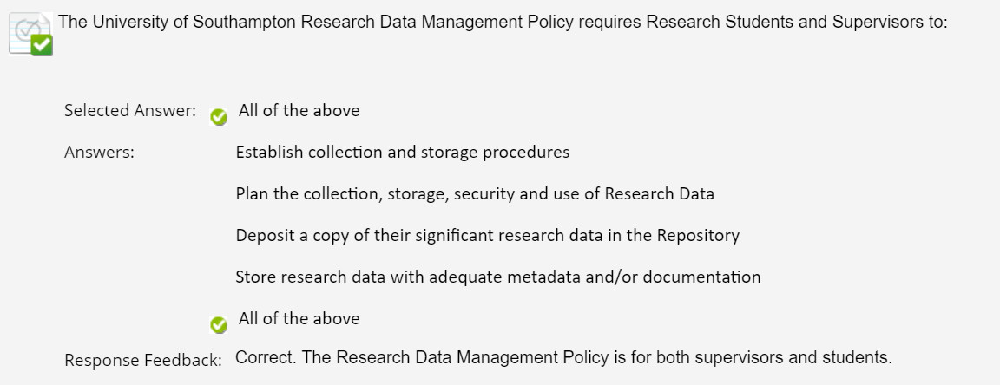
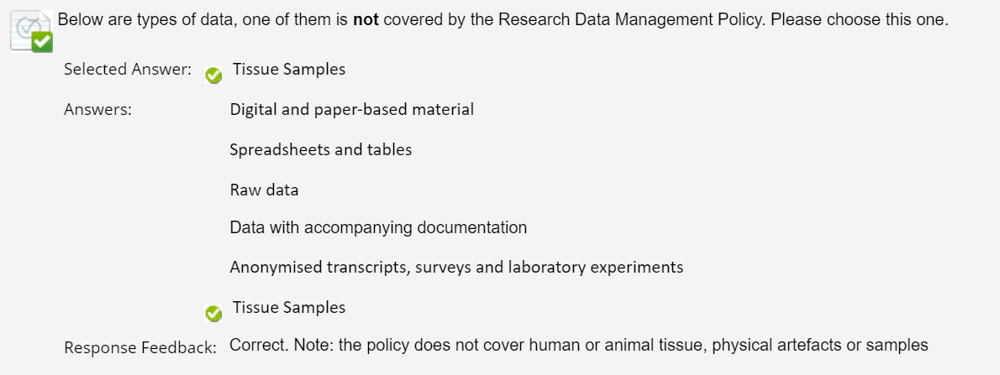
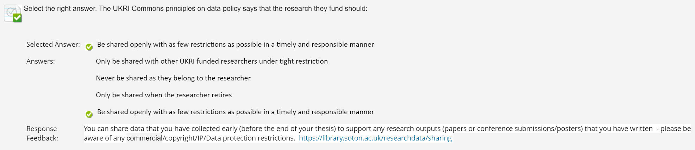
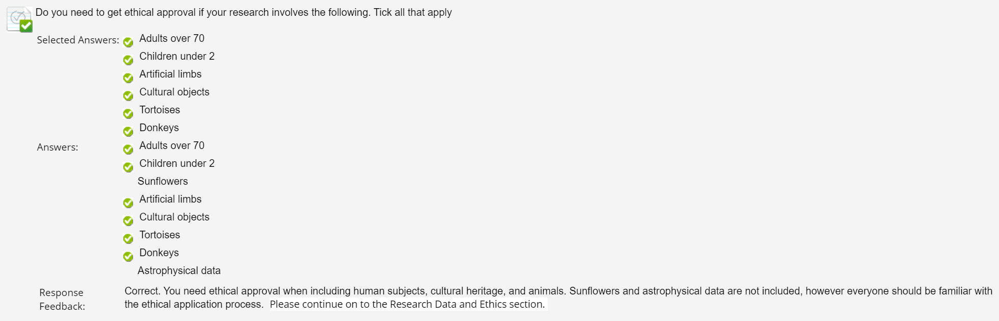
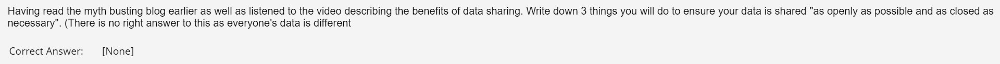

# Data Management Plan

### Editor: Haosen Yu (April 14. 2023)

## Where to find the tests:

No 1. and No 2. are in "Research Data or Materials"
No 3.  No 4. and No 5. are in "Introduction to Research Data Management and Data Management plans"
No 6. No 7.and No 8. are in "What policies will apply to your research"
No 9. is in "How will you deal with any copyright, intellectual property rights or ethical issues"
No 10 is in "What are your plans for sharing your research data"

## No. 1

## No. 2

## No. 3

## No. 4

## No. 5

## No. 6

## No. 7

## No. 8

## No. 9

## No. 10

