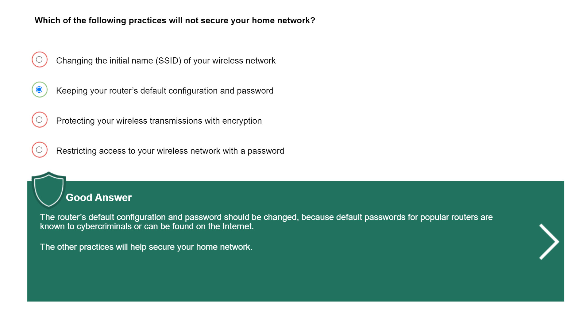

# Email Security and Phishing

### Editor: Haosen Yu (April 15. 2023)

## Email

## Business Email Compromise

## Business Email Compromise (BEC)

None

## C-Level email impersonation

None

## Phishing

## Mass Market Phishing - Amazon Gift Card

None

## Phishing - Six Clues That Should Raise Your Suspicions

None

***WARNING: All right reserved, do NOT copy without editor's(Haosen Yu) permission!***
