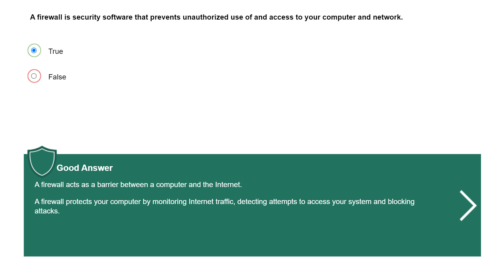

# Working Securely Away from Campus

### Editor: Haosen Yu (April 15. 2023)

## Working Remotely

## Protecting Your Home Computer

## Social Networks

## Cloud Computing

## Mobile Devices

## Traveling Securely

***WARNING: All right reserved, do NOT copy without editor's(Haosen Yu) permission!***
